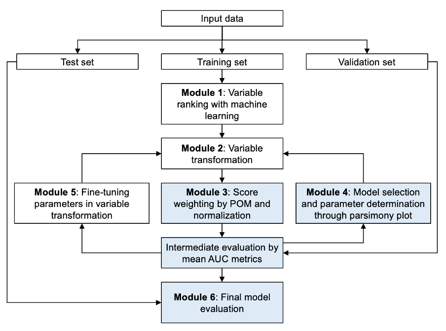
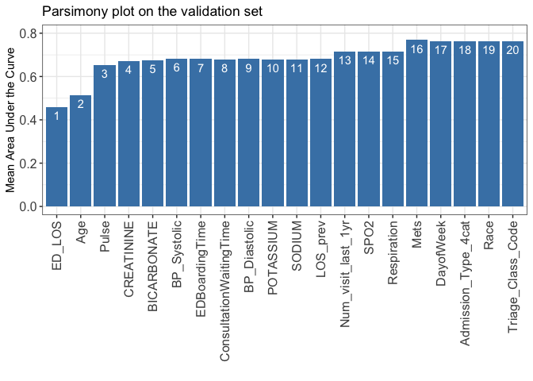

AutoScore-Ordinal: An Interpretable Machine Learning Framework for
Generating Scoring Models for Ordinal Outcomes
================

-   [**AutoScore-Ordinal
    Introduction**](#autoscore-ordinal-introduction)
    -   [Description](#description)
    -   [Functions and pipeline](#functions-and-pipeline)
    -   [Contact](#contact)
-   [**Install the package and prepare
    data**](#install-the-package-and-prepare-data)
    -   [Install from GitHub:](#install-from-github)
    -   [Load R package](#load-r-package)
    -   [Load data](#load-data)
    -   [Data preprocessing](#data-preprocessing)
    -   [AutoScore-Ordinal
        preprocessing](#autoscore-ordinal-preprocessing)
-   [**AutoScore-Ordinal
    Demonstration**](#autoscore-ordinal-demonstration)
    -   [Prepare training, validation, and test
        datasets](#prepare-training-validation-and-test-datasets)
    -   [STEP(i): Generate variable ranking list (AutoScore-Ordinal
        Module 1)](#stepi-generate-variable-ranking-list-autoscore-ordinal-module-1)
    -   [STEP(ii): Select the best model with parsimony plot
        (AutoScore-Ordinal Modules
        2+3+4)](#stepii-select-the-best-model-with-parsimony-plot-autoscore-ordinal-modules-234)
    -   [STEP(iii): Generate initial scores with the final list of
        variables (Re-run AutoScore-Ordinal Modules
        2+3)](#stepiii-generate-initial-scores-with-the-final-list-of-variables-re-run-autoscore-ordinal-modules-23)
    -   [STEP(iv): Fine-tune the initial score generated in STEP(iii)
        (AutoScore-Ordinal Module 5 & Re-run AutoScore-Ordinal Modules
        2+3)](#stepiv-fine-tune-the-initial-score-generated-in-stepiii-autoscore-ordinal-module-5--re-run-autoscore-ordinal-modules-23)
    -   [STEP(v): Evaluate final risk scores on test dataset
        (AutoScore-Ordinal
        Module 6)](#stepv-evaluate-final-risk-scores-on-test-dataset-autoscore-ordinal-module-6)

# **AutoScore-Ordinal Introduction**

-   GitHub Package (version 1.0.0)

### Description

AutoScore-Ordinal is a novel machine learning framework to automate the
development of interpretable clinical scoring models for ordinal
outcomes, which expands the [original AutoScore framework for binary
outcomes](https://github.com/nliulab/AutoScore). AutoScore-Ordinal
modifies the six modules of the AutoScore framework to handle ordinal
outcomes: 1) variable ranking with machine learning, 2) variable
transformation, 3) score derivation (now from the proportional odds
model), 4) model selection, 5) domain knowledge-based score fine-tuning,
and 6) performance evaluation (using the mean AUC (mAUC) across binary
classifications). The AutoScore-Ordinal is elaborated in the manuscript
*“AutoScore-Ordinal: An Interpretable Machine Learning Framework for
Generating Scoring Models for Ordinal Outcomes”* and its flowchart is
shown in the following figure, where blue shading indicate modifications
from the original AutoScore framework. AutoScore-Ordinal could
seamlessly generate risk scores using a parsimonious set of variables,
which can be easily implemented and validated in clinical practice.
Moreover, it enables users to build transparent and interpretable
clinical scores quickly in a straightforward manner.

<div class="figure" style="text-align: center">



</div>

### Functions and pipeline

The five pipeline functions: `AutoScore_Ordinal_rank()`,
`AutoScore_Ordinal_parsimony()`, `AutoScore_Ordinal_weighting()`,
`AutoScore_fine_Ordinal_tuning()` and `AutoScore_Ordinal_testing()`
constitute the 5-step AutoScore-Ordinal-based process for generating
point-based clinical scores. This 5-step process gives users the
flexibility of customization (e.g., determining the final list of
variables according to the parsimony plot, and fine-tuning the cutoffs
in variable transformation). Please follow the step-by-step instructions
(in the [Demonstration](#Demo)) to build your own scores.

-   STEP(i): `AutoScore_Ordinal_rank()` - Rank variables with random
    forest for multiclass classification (AutoScore-Ordinal Module 1)
-   STEP(ii): `AutoScore_Ordinal_parsimony()` - Select the best model
    with parsimony plot (AutoScore-Ordinal Modules 2+3+4)
-   STEP(iii): `AutoScore_Ordinal_weighting()` - Generate the initial
    score with the final list of variables (Re-run AutoScore-Ordinal
    Modules 2+3)
-   STEP(iv): `AutoScore_Ordinal_fine_tuning()` - Fine-tune the score by
    revising `cut_vec` with domain knowledge (AutoScore-Ordinal
    Module 5)
-   STEP(v): `AutoScore_Ordinal_testing()` - Evaluate the final score
    using performence metrics for ordinal classification (mAUC and
    generalised c-index) (AutoScore-Ordinal Module 6)

Note: This is just the initial version of the AutoScore-Ordinal. Further
version will be developed and updated.

<!--
### Citation

Xie F, Chakraborty B, Ong MEH, Goldstein BA, Liu N. AutoScore: A Machine Learning-Based Automatic Clinical Score Generator and Its Application to Mortality Prediction Using Electronic Health Records. JMIR Medical Informatics 2020;8(10):e21798 (<http://dx.doi.org/10.2196/21798>)
-->

### Contact

-   Yilin Ning (Email: <yilin.ning@duke-nus.edu.sg>)
-   Nan Liu (Email: <liu.nan@duke-nus.edu.sg>)

# **Install the package and prepare data**

### Install from GitHub:

``` r
# From Github
install.packages("devtools")
library(devtools)
install_github(repo = "nliulab/AutoScore-Ordinal")
```

### Load R package

``` r
library(AutoScoreOrdinal)
```

### Load data

-   Read data from CSV or Excel files.
-   For this demo, use the integrated `sample_data_ordinal` in the
    package.
-   `sample_data_ordinal` has 20000 simulated samples, with similar
    distribution to the data used in the paper.

``` r
data("sample_data_ordinal")
head(sample_data_ordinal)
##      ED_LOS Age Gender    Race Triage_Class_Code EDBoardingTime
## 1 3.5933333  63 FEMALE   Malay                P2           8.72
## 2 3.6288889  41 FEMALE   Malay                P2           1.28
## 3 2.6502778  86   MALE Chinese                P1           6.00
## 4 4.9711111  51   MALE Chinese                P2           7.13
## 5 0.5352778  23 FEMALE  Indian                P1           1.53
## 6 4.4008333  32 FEMALE  Indian                P2           3.47
##   ConsultationWaitingTime DayofWeek VENTILATION resuscitation
## 1                    0.60         4           0             0
## 2                    0.97         4           0             0
## 3                    1.04         4           0             0
## 4                    1.21         4           0             0
## 5                    0.59         4           0             0
## 6                    0.76         4           0             0
##   Num_visit_last_1yr Total_Num_Surgery_last1yr Total_icu_count_last1yr
## 1                  0                         0                       0
## 2                  0                         1                       0
## 3                  0                         0                       0
## 4                  0                         0                       0
## 5                  0                         0                       0
## 6                  0                         0                       0
##   Total_hd_count_last1yr label Admission_Type_4cat LOS_prev Pulse Respiration
## 1                      0     1                  B2     0.00    91          19
## 2                      0     1                  B2     0.96    91          16
## 3                      0     1                  A1     0.00   100          18
## 4                      0     1                  B2     0.00    73          17
## 5                      0     1                  B2     0.00    74          18
## 6                      0     1                  B2     4.13    77          18
##   SPO2 BP_Diastolic BP_Systolic BICARBONATE CREATININE POTASSIUM SODIUM MI CHF
## 1  100           70         152        25.7        117       3.9    136  0   0
## 2  100           70         147        22.6        500       3.6    114  0   0
## 3   99           65         126        25.7         72       4.1    136  0   0
## 4   97           46         100        24.9         67       5.0    122  0   0
## 5   98           89         114        25.7       1036       4.1    138  0   0
## 6   98           74         157        25.3        806       4.1    136  0   0
##   PVD Stroke Dementia Pulmonary Rheumatic PUD LiverMild DM_disease DMcx
## 1   0      0        0         0         0   0         1          0    0
## 2   0      0        0         1         0   1         0          1    0
## 3   0      0        0         0         0   0         0          0    0
## 4   0      0        0         0         0   0         0          0    0
## 5   0      0        0         0         0   0         0          0    1
## 6   0      0        0         0         0   0         0          1    1
##   Paralysis Renal Cancer LiverSevere Mets
## 1         0     1      0           0    0
## 2         0     0      0           0    0
## 3         0     1      0           0    0
## 4         0     0      0           0    0
## 5         0     0      0           0    0
## 6         0     0      0           0    0
```

### Data preprocessing

**Users to check the following:**

-   Handle missing values (AutoScore-Ordinal requires a complete
    dataset).
-   Remove special characters from variable names, e.g., `[`, `]`, `(`,
    `)`,`,`. (Suggest using `_` to replace them if needed)
-   Name of the variable should be unique and not entirely included by
    other variable names.
-   Ensure that the dependent variable is named “label” (make sure no
    variables using the same name) and is coded as class: factor.
-   Independent variables should be numeric (class: num/int) or
    categorical (class: factor/logic).
-   Handle outliers (optional).
-   Check variable distribution (optional).

### AutoScore-Ordinal preprocessing

**Users to check the following:**

-   Check if data fulfil the basic requirement by AutoScore-Ordinal.
-   Fix the problem if you see any warnings.

``` r
check_data(sample_data_ordinal)
## 
##  missing value check passed.
```

-   Modify your data to ensure no warning messages.

<h id="Demo">

# **AutoScore-Ordinal Demonstration**

In this Demo, we demonstrate the use of AutoScore-Ordinal on a
relatively large dataset where separate training and validation sets are
available. Please note that it is just a demo using simulated data, and
thus, the result might not be clinically meaningful.

### Prepare training, validation, and test datasets

-   Option 1: Prepare three separate datasets to train, validate, and
    test models.
-   Option 2: Use demo codes below to randomly split your dataset into
    training, validation, and test datasets (70%, 10%, 20%,
    respectively), possibly stratified by outcome categories
    (`strat_by_label = TRUE`) to ensure they are well represented in all
    three datasets.

``` r
set.seed(1234)
out_split <- split_data(data = sample_data_ordinal, ratio = c(0.7, 0.1, 0.2), 
                        strat_by_label = TRUE)
train_set <- out_split$train_set
validation_set <- out_split$validation_set
test_set <- out_split$test_set
```

### STEP(i): Generate variable ranking list (AutoScore-Ordinal Module 1)

-   `ntree`: Number of trees in the random forest algorithm (Default:
    100).

``` r
ranking <- AutoScore_Ordinal_rank(train_set = train_set, ntree = 100)
## The ranking based on variable importance was shown below for each variable: 
##                    ED_LOS                       Age                     Pulse 
##               295.1751048               279.4486712               275.7915008 
##                CREATININE               BICARBONATE               BP_Systolic 
##               274.3689229               274.1921965               270.2830318 
##            EDBoardingTime   ConsultationWaitingTime              BP_Diastolic 
##               269.3350087               245.3335064               238.2404464 
##                 POTASSIUM                    SODIUM                  LOS_prev 
##               216.6578878               199.0595672               178.2319358 
##        Num_visit_last_1yr                      SPO2               Respiration 
##               174.7796118               140.5779487               125.5648099 
##                      Mets                 DayofWeek       Admission_Type_4cat 
##               115.0377463               109.7045225                82.5270306 
##                      Race         Triage_Class_Code Total_Num_Surgery_last1yr 
##                79.9933022                70.7209621                48.8358944 
##                    Gender                      DMcx    Total_hd_count_last1yr 
##                38.6643611                32.6850597                32.2837377 
##                     Renal                    Stroke                DM_disease 
##                31.3256323                29.0438284                26.1299721 
##                       CHF                 Pulmonary                    Cancer 
##                23.2271458                22.9750173                21.8470042 
##                       PVD                        MI                 LiverMild 
##                19.6369170                18.6250098                17.9263123 
##                  Dementia                 Paralysis                       PUD 
##                17.1947699                17.1266926                13.5934333 
##             resuscitation   Total_icu_count_last1yr               LiverSevere 
##                11.9823329                 9.6201264                 8.9651893 
##                 Rheumatic               VENTILATION 
##                 8.7027377                 0.2250472
```

### STEP(ii): Select the best model with parsimony plot (AutoScore-Ordinal Modules 2+3+4)

-   `nmin`: Minimum number of selected variables (Default: 1).
-   `nmax`: Maximum number of selected variables (Default: 20).
-   `categorize`: Methods for categorizing continuous variables. Options
    include `"quantile"` or `"kmeans"` (Default: `"quantile"`).
-   `quantiles`: Predefined quantiles to convert continuous variables to
    categorical ones. (Default: `c(0, 0.05, 0.2, 0.8, 0.95, 1)`)
    Available if `categorize = "quantile"`.
-   `max_cluster`: The max number of cluster (Default: 5). Available if
    `categorize = "kmeans"`.
-   `max_score`: Maximum total score (Default: 100).
-   `auc_lim_min`: y-axis limits (min) of the parsimony plot (Default:
    0.5)
-   `auc_lim_max`: y-axis limits (max) of the parsimony plot (Default:
    “adaptive”)

``` r
mAUC <- AutoScore_Ordinal_parsimony(
  train_set = train_set, validation_set = validation_set, 
  rank = ranking,
  max_score = 100,
  n_min = 1,
  n_max = 20,
  categorize = "quantile",
  quantiles = c(0, 0.05, 0.2, 0.8, 0.95, 1), 
  auc_lim_min = 0
)
## Select 1 variables:  0.4581387 
## Select 2 variables:  0.5145623 
## Select 3 variables:  0.6528213 
## Select 4 variables:  0.6716182 
## Select 5 variables:  0.6741575 
## Select 6 variables:  0.6823551 
## Select 7 variables:  0.6806747 
## Select 8 variables:  0.6793723 
## Select 9 variables:  0.6811396 
## Select 10 variables:  0.6785473 
## Select 11 variables:  0.6783959 
## Select 12 variables:  0.6805645 
## Select 13 variables:  0.7159785 
## Select 14 variables:  0.7148 
## Select 15 variables:  0.7151882 
## Select 16 variables:  0.768855 
## Select 17 variables:  0.7637719 
## Select 18 variables:  0.7637437 
## Select 19 variables:  0.7642515 
## Select 20 variables:  0.7626574
```

<!-- -->

-   Determine the optimal number of variables (`num_var`) based on the
    parsimony plot obtained in STEP(ii).
-   The final list of variables is the first `num_var` variables in the
    ranked list `ranking` obtained in STEP(i).
-   Optional: User can adjust the finally included variables
    `final_variables` based on the clinical preferences and knowledge.

``` r
# Example 1: Top 6 variables are selected
num_var <- 6
final_variables <- names(ranking[1:num_var])

# Example 2: Top 16 variables are selected
num_var <- 16
final_variables <- names(ranking[1:num_var])

# Example 3: Top 6 variables, the 13th and 16th variable are selected
final_variables <- names(ranking[c(1:6, 13, 16)])
```

### STEP(iii): Generate initial scores with the final list of variables (Re-run AutoScore-Ordinal Modules 2+3)

-   Generate `cut_vec` with current cutoffs of continuous variables,
    which can be fine-tuned in STEP(iv).
-   Performance of resulting scores is evaluated using mAUC, with 95%
    confidence interval (CI) computed using bootstrap (by default from
    `n_boot = 100` bootstrap samples.

``` r
cut_vec <- AutoScore_Ordinal_weighting(
  train_set = train_set, validation_set = validation_set, 
  final_variables = final_variables, 
  max_score = 100,
  categorize = "quantile",
  quantiles = c(0, 0.05, 0.2, 0.8, 0.95, 1), n_boot = 100
)
## ****Included Variables: 
##        variable_name
## 1             ED_LOS
## 2                Age
## 3              Pulse
## 4         CREATININE
## 5        BICARBONATE
## 6        BP_Systolic
## 7 Num_visit_last_1yr
## 8               Mets
## ****Initial Scores: 
## 
## 
## ==================  ============  =====
## variable            interval      point
## ==================  ============  =====
## ED_LOS              <0.649          9  
##                     [0.649,1.33)    6  
##                     [1.33,3.93)     3  
##                     [3.93,5.9)      0  
##                     >=5.9           0  
##                                        
## Age                 <27             0  
##                     [27,46)         2  
##                     [46,78)        12  
##                     [78,87)        16  
##                     >=87           19  
##                                        
## Pulse               <58             4  
##                     [58,68)         0  
##                     [68,97)         3  
##                     [97,113)        6  
##                     >=113          11  
##                                        
## CREATININE          <46             5  
##                     [46,61)         0  
##                     [61,136)        1  
##                     [136,603)       7  
##                     >=603           6  
##                                        
## BICARBONATE         <16.7           8  
##                     [16.7,20.5)     4  
##                     [20.5,25.4)     0  
##                     [25.4,28)       0  
##                     >=28            4  
##                                        
## BP_Systolic         <99             8  
##                     [99,112)        5  
##                     [112,153)       1  
##                     [153,179)       0  
##                     >=179           0  
##                                        
## Num_visit_last_1yr  <1              0  
##                     [1,4)          10  
##                     >=4            19  
##                                        
## Mets                0               0  
##                     1              20  
## ==================  ============  =====
## ***Performance (based on validation set):
## mAUC: 0.7737, 95% bootstrap CI: 0.7410-0.8008
## ***The cutoffs of each variables generated by the AutoScore-Ordinal are saved in cut_vec. You can decide whether to revise or fine-tune them
```

### STEP(iv): Fine-tune the initial score generated in STEP(iii) (AutoScore-Ordinal Module 5 & Re-run AutoScore-Ordinal Modules 2+3)

-   Revise `cut_vec` with domain knowledge to update the scoring table
    (AutoScore-Ordinal Module 5).
-   Re-run AutoScore-Ordinal Modules 2+3 to generate the updated scores.
-   Users can choose any cutoff values and/or any number of categories,
    but are suggested to choose numbers close to the automatically
    determined values.

``` r
## For example, we have current cutoffs of continuous variable: Age 
## ==============  ===========  =====
## variable        interval     point
## ==============  ===========  =====
## Age                 <27          0  
##                     [27,46)      2  
##                     [46,78)     12  
##                     [78,87)     16 
##                     >=87        19 
```

-   Current cutoffs:`c(27, 46, 78, 87)`. We can fine tune the cutoffs as
    follows:

``` r
# Example 1: rounding to a nice number
cut_vec$Age <- c(25, 45, 75, 85)

# Example 2: changing cutoffs according to clinical knowledge or preference 
cut_vec$Age <- c(25, 50, 75, 85)

# Example 3: combining categories
cut_vec$Age <- c(45, 75, 85)
```

The mAUC and 95% bootstrap CI are reported after fine-tuning. The
default number of bootstrap samples is again `n_boot = 100`.

``` r
cut_vec$ED_LOS <- c(2 / 3, 4 / 3, 4, 6)
cut_vec$Age <- c(25, 45, 75, 85)
cut_vec$Pulse <- c(60, 70, 95, 115)
cut_vec$CREATININE <- c(45, 60, 135, 595)
cut_vec$BICARBONATE <- c(17, 20, 25, 28)
cut_vec$BP_Systolic <- c(100, 110, 150, 180)
scoring_table <- AutoScore_Ordinal_fine_tuning(
  train_set = train_set, validation_set = validation_set,
  final_variables = final_variables, cut_vec = cut_vec,
  max_score = 100, n_boot = 100
)
## ***Fine-tuned Scores: 
## 
## 
## ==================  ============  =====
## variable            interval      point
## ==================  ============  =====
## ED_LOS              <0.667          9  
##                     [0.667,1.33)    6  
##                     [1.33,4)        2  
##                     [4,6)           0  
##                     >=6             0  
##                                        
## Age                 <25             0  
##                     [25,45)         3  
##                     [45,75)        13  
##                     [75,85)        17  
##                     >=85           20  
##                                        
## Pulse               <60             2  
##                     [60,70)         0  
##                     [70,95)         2  
##                     [95,115)        5  
##                     >=115          12  
##                                        
## CREATININE          <45             6  
##                     [45,60)         0  
##                     [60,135)        1  
##                     [135,595)       7  
##                     >=595           6  
##                                        
## BICARBONATE         <17             8  
##                     [17,20)         4  
##                     [20,25)         0  
##                     [25,28)         0  
##                     >=28            4  
##                                        
## BP_Systolic         <100            8  
##                     [100,110)       5  
##                     [110,150)       1  
##                     [150,180)       0  
##                     >=180           0  
##                                        
## Num_visit_last_1yr  <1              0  
##                     [1,4)           9  
##                     >=4            19  
##                                        
## Mets                0               0  
##                     1              19  
## ==================  ============  =====
## ***Performance (based on Validation Set, after fine-tuning):
## mAUC: 0.7793, 95% bootstrap CI: 0.7350-0.8053
```

### STEP(v): Evaluate final risk scores on test dataset (AutoScore-Ordinal Module 6)

The mAUC and generalised c-index are reported for the test set, with 95%
bootstrap CI computed from `n_boot = 100` bootstrap samples (default).

``` r
pred_score <- AutoScore_Ordinal_testing(
  test_set = test_set, 
  final_variables = final_variables, cut_vec = cut_vec, 
  score_table = scoring_table, 
  with_label = TRUE, n_boot = 100
)
## ***Performance using AutoScore-Ordinal (based on unseen test Set):
## mAUC: 0.7431, 95% bootstrap CI: 0.7221-0.7623
## Generalised c-index: 0.7197, 95% bootstrap CI: 0.6984-0.7348
head(pred_score)
##   pred_score Label
## 1         36     1
## 2         17     1
## 3         17     1
## 4         25     1
## 5         49     1
## 6         24     1
```

-   Users could use the `pred_score` for further analysis or export it
    as the CSV to other software.

``` r
write.csv(pred_score, file = "pred_score.csv")
```

<!---
To-do:
- [done] Add bootstrap CI for mAUC
- [done] Remove threshold from scoring table
- Give a function to produce mapping table from training set
- Give a function to make bar plot
-->
